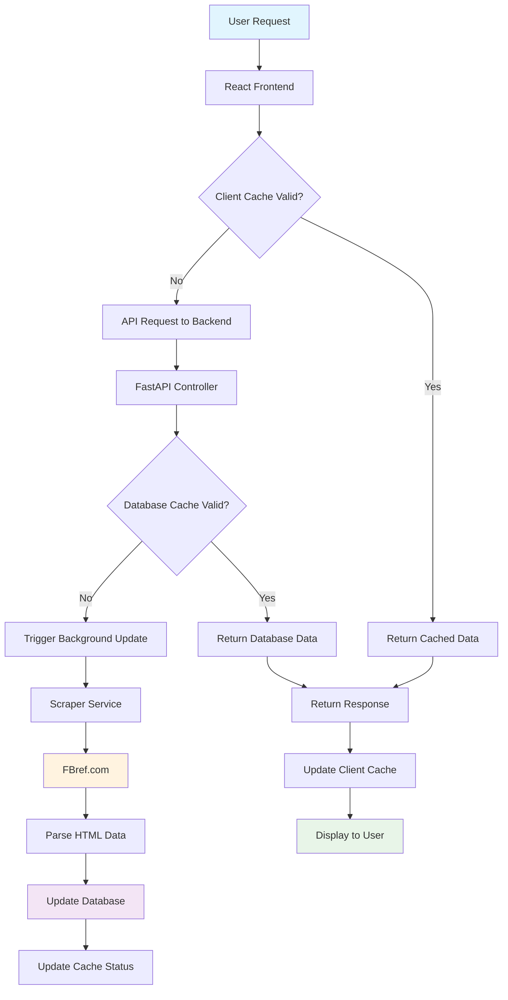
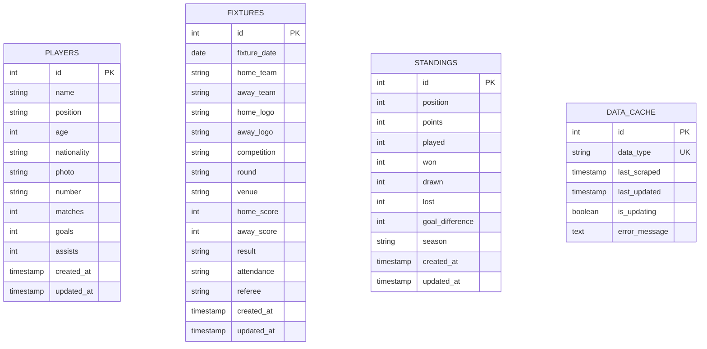
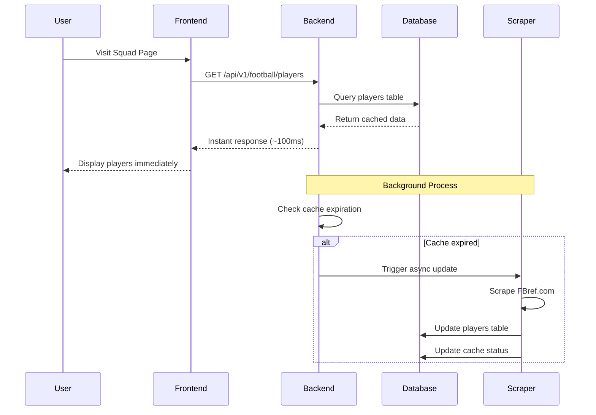
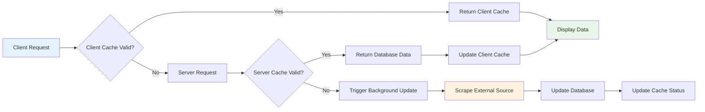
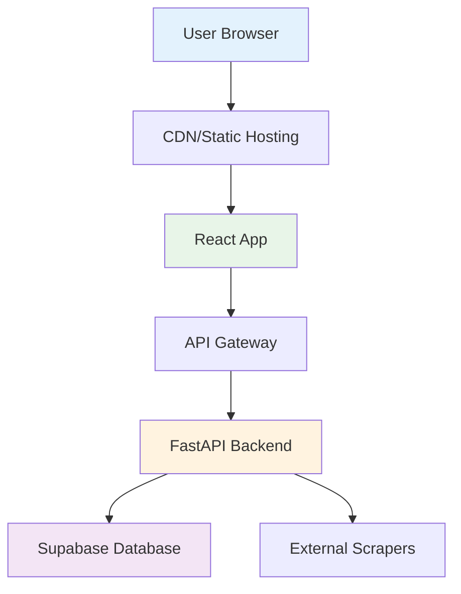
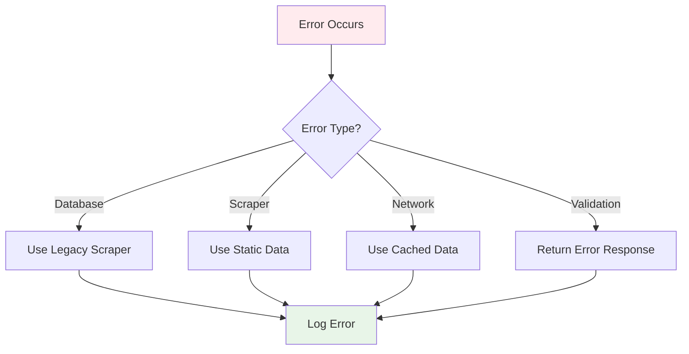

# 🏗️ Real Racing Santander Website System Architecture

## 📋 System Overview

The Real Racing Santander website is a modern, high-performance web application that provides instant access to football data with intelligent background updates. The system combines a React frontend with a FastAPI backend, powered by Supabase for data persistence and real-time updates.

## 🎯 Key Features

- ⚡ **Instant Data Loading**: Sub-second response times from database
- 🔄 **Smart Background Updates**: Automatic data refresh from web scraping
- 🛡️ **Multiple Fallback Layers**: Database → Legacy scraper → Static data
- 📊 **Real-time Cache Monitoring**: Live status of data freshness
- 🚀 **Modern Tech Stack**: React, FastAPI, Supabase, BeautifulSoup

## 🏛️ System Architecture

```
┌─────────────────────────────────────────────────────────────────┐
│                        FRONTEND LAYER                          │
├─────────────────────────────────────────────────────────────────┤
│  React App (Vite)                                              │
│  ├── Home Page (Dashboard)                                     │
│  ├── Squad Page (Players)                                      │
│  ├── History Page (Fixtures)                                   │
│  └── Admin Page (Data Management)                              │
└─────────────────────────────────────────────────────────────────┘
                                │
                                │ HTTP/JSON API
                                ▼
┌─────────────────────────────────────────────────────────────────┐
│                       BACKEND LAYER                            │
├─────────────────────────────────────────────────────────────────┤
│  FastAPI Application                                           │
│  ├── Controllers (API Routes)                                  │
│  ├── Services (Business Logic)                                 │
│  ├── Models (Data Structures)                                  │
│  └── Middleware (CORS, Logging, Error Handling)                │
└─────────────────────────────────────────────────────────────────┘
                                │
                                │ Database Operations
                                ▼
┌─────────────────────────────────────────────────────────────────┐
│                      DATA LAYER                                │
├─────────────────────────────────────────────────────────────────┤
│  Supabase (PostgreSQL)                                         │
│  ├── players table                                             │
│  ├── fixtures table                                            │
│  ├── standings table                                           │
│  └── data_cache table                                          │
└─────────────────────────────────────────────────────────────────┘
                                │
                                │ Web Scraping
                                ▼
┌─────────────────────────────────────────────────────────────────┐
│                    EXTERNAL DATA SOURCE                        │
├─────────────────────────────────────────────────────────────────┤
│  FBref.com (Football Statistics)                               │
│  └── Racing Santander Team Data                                │
└─────────────────────────────────────────────────────────────────┘
```

## 🔄 Data Flow Architecture



## 📊 Database Schema



## 🔧 Component Architecture

### Frontend Components

```
src/
├── App.jsx                    # Main application router
├── components/
│   ├── Header.jsx            # Navigation header
│   └── Footer.jsx            # Site footer
├── pages/
│   ├── Home.jsx              # Dashboard with overview
│   ├── Squad.jsx             # Players/squad display
│   ├── History.jsx           # Fixtures history
│   └── Admin.jsx             # Data management interface
├── hooks/
│   └── useFootballData.js    # Data fetching and caching logic
└── styles/
    └── colors.css            # Design system
```

### Backend Services

```
backend/
├── main.py                   # FastAPI application entry point
├── controllers/
│   ├── football_controller.py    # Football data API endpoints
│   ├── scraper_controller.py     # Web scraping endpoints
│   ├── items_controller.py       # Generic items CRUD
│   └── health_controller.py      # Health check endpoints
├── services/
│   ├── football_service.py       # Football data business logic
│   ├── scraper_service.py        # FBref.com scraping logic
│   └── db_service.py             # Database operations
├── models/
│   ├── football.py              # Pydantic data models
│   └── item.py                  # Generic item models
└── middleware/
    ├── cors.py                  # CORS configuration
    ├── error_handling.py        # Error handling middleware
    └── logging.py               # Request logging
```

## ⚡ Instant Loading Flow



## 🔄 Cache Management Strategy



## 🛡️ Fallback System

```mermaid
graph TD
    A[Data Request] --> B[Primary: Database]
    B --> C{Database Available?}
    C -->|Yes| D[Return Database Data]
    C -->|No| E[Secondary: Legacy Scraper]
    E --> F{Scraper Available?}
    F -->|Yes| G[Return Scraped Data]
    F -->|No| H[Tertiary: Static Data]
    H --> I[Return Static Fallback]
    D --> J[Success Response]
    G --> J
    I --> J

    style A fill:#e3f2fd
    style J fill:#e8f5e8
    style H fill:#fff3e0
```



## 📈 Performance Characteristics

| Component           | Response Time | Cache Duration | Update Frequency |
| ------------------- | ------------- | -------------- | ---------------- |
| **Database Query**  | ~50-100ms     | N/A            | Real-time        |
| **Client Cache**    | ~1-5ms        | 30 seconds     | On demand        |
| **Server Cache**    | ~100-200ms    | 5-15 minutes   | Background       |
| **Web Scraping**    | 5-30 seconds  | N/A            | Background only  |
| **Static Fallback** | ~1ms          | N/A            | Never            |

## 🔍 API Endpoints

### Primary Endpoints (Instant Load)

| Endpoint                     | Method | Description         | Response Time |
| ---------------------------- | ------ | ------------------- | ------------- |
| `/api/v1/football/players`   | GET    | Get squad data      | ~100ms        |
| `/api/v1/football/fixtures`  | GET    | Get fixtures data   | ~100ms        |
| `/api/v1/football/standings` | GET    | Get league position | ~100ms        |
| `/api/v1/football/status`    | GET    | Get cache status    | ~50ms         |

### Management Endpoints

| Endpoint                          | Method | Description            |
| --------------------------------- | ------ | ---------------------- |
| `/api/v1/football/refresh`        | POST   | Force refresh all data |
| `/api/v1/football/load-players`   | POST   | Manual load players    |
| `/api/v1/football/load-fixtures`  | POST   | Manual load fixtures   |
| `/api/v1/football/load-standings` | POST   | Manual load standings  |

### Legacy Endpoints (Fallback)

| Endpoint                   | Method | Description     | Response Time |
| -------------------------- | ------ | --------------- | ------------- |
| `/api/v1/scrape/players`   | GET    | Direct scraping | 5-30s         |
| `/api/v1/scrape/fixtures`  | GET    | Direct scraping | 5-30s         |
| `/api/v1/scrape/standings` | GET    | Direct scraping | 5-30s         |

## 🚀 Deployment Architecture



## 🔧 Configuration Management

### Environment Variables

```bash
# Supabase Configuration
SUPABASE_PROJECT_URL=https://your-project.supabase.co
SUPABASE_API_KEY=your-anon-key

# Application Configuration
CACHE_DURATION_PLAYERS=15    # minutes
CACHE_DURATION_FIXTURES=5    # minutes
CACHE_DURATION_STANDINGS=10  # minutes
```

### Cache Configuration

```python
# Server-side cache durations
cache_durations = {
    "players": 15,      # 15 minutes (less frequent changes)
    "fixtures": 5,      # 5 minutes (more frequent updates)
    "standings": 10     # 10 minutes (regular updates)
}

# Client-side cache duration
client_cache_duration = 30  # seconds
```

## 📊 Monitoring & Observability

### Health Checks

- **Database Connectivity**: Real-time Supabase connection status
- **Scraper Health**: Success/failure rates of web scraping
- **Cache Status**: Last update times and expiration status
- **API Performance**: Response times and error rates

### Logging Strategy

```python
# Structured logging with request tracking
logger.info(f"[{request_id}] Retrieved {count} players from database")
logger.warning(f"[{request_id}] Cache expired, triggering update")
logger.error(f"[{request_id}] Scraping failed: {error}")
```

### Metrics Collection

- Request response times
- Cache hit/miss ratios
- Scraping success rates
- Database query performance
- Error rates by endpoint

## 🔒 Security Considerations

### API Security

- CORS configuration for frontend access
- Rate limiting on scraping endpoints
- Input validation with Pydantic models
- Error message sanitization

### Data Security

- Supabase Row Level Security (RLS)
- Environment variable protection
- Database connection encryption
- API key rotation

## 🚨 Error Handling Strategy



## 🎯 Key Benefits

1. **⚡ Instant User Experience**: Sub-second loading times
2. **🔄 Always Fresh Data**: Background updates ensure data currency
3. **🛡️ High Reliability**: Multiple fallback layers
4. **📊 Real-time Monitoring**: Live cache and update status
5. **🚀 Scalable Architecture**: Database-backed with async updates
6. **🔧 Easy Maintenance**: Clear separation of concerns
7. **📱 Modern UX**: React-based responsive interface

## 🔮 Future Enhancements

- **Real-time Updates**: WebSocket integration for live data
- **Advanced Caching**: Redis for distributed caching
- **Analytics Dashboard**: Detailed performance metrics
- **Mobile App**: React Native companion app
- **Push Notifications**: Match updates and alerts
- **Social Features**: User comments and predictions

---

_This system represents a modern, production-ready architecture that prioritizes user experience while maintaining data accuracy and system reliability._
