# 🔄 Real Racing Santander System Flowcharts

## 📊 System Overview Flowchart

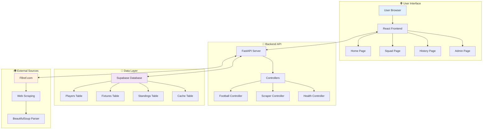

## ⚡ Instant Data Loading Flow

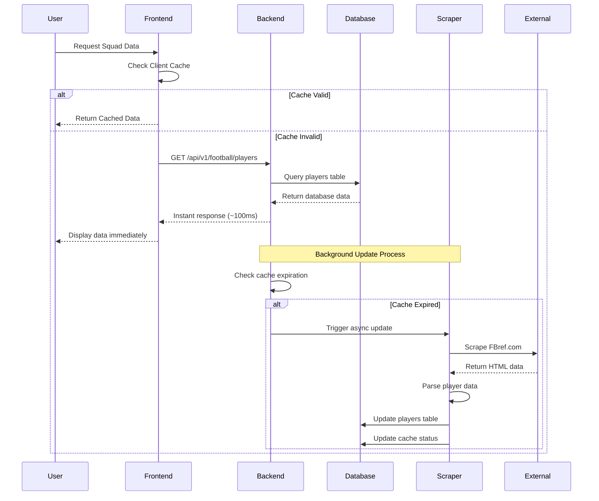

## 🔄 Cache Management Flow

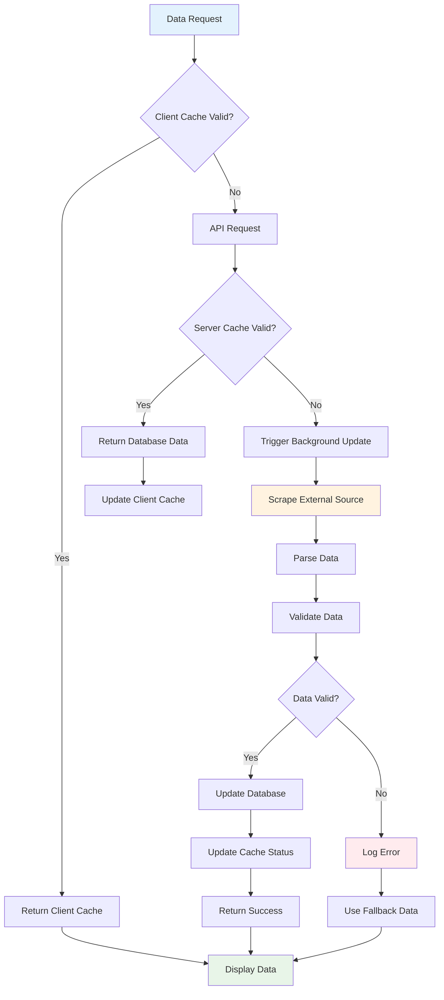

## 🛡️ Fallback System Flow

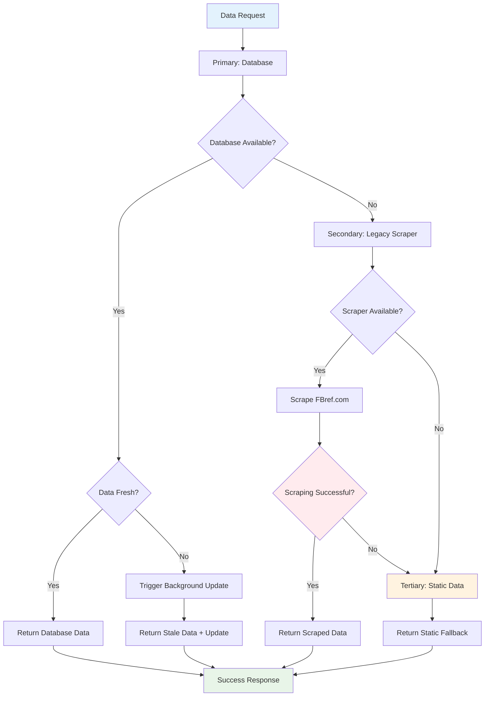

## 📊 Database Operations Flow

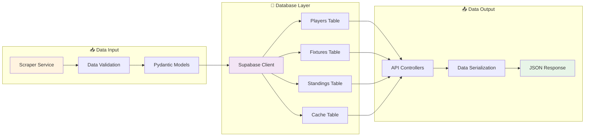

## 🔧 Error Handling Flow

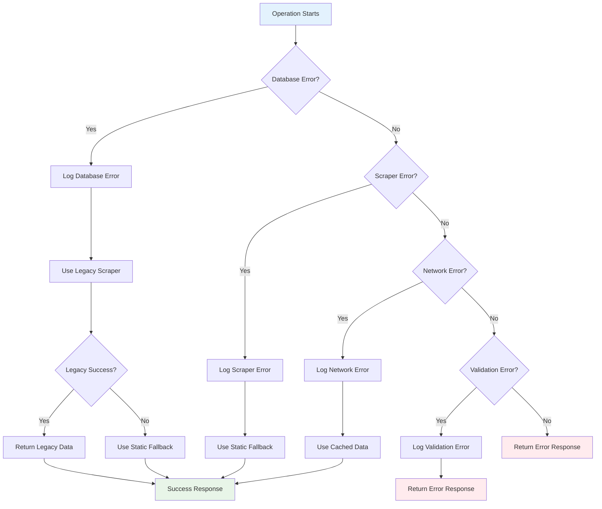

## 🚀 Performance Optimization Flow

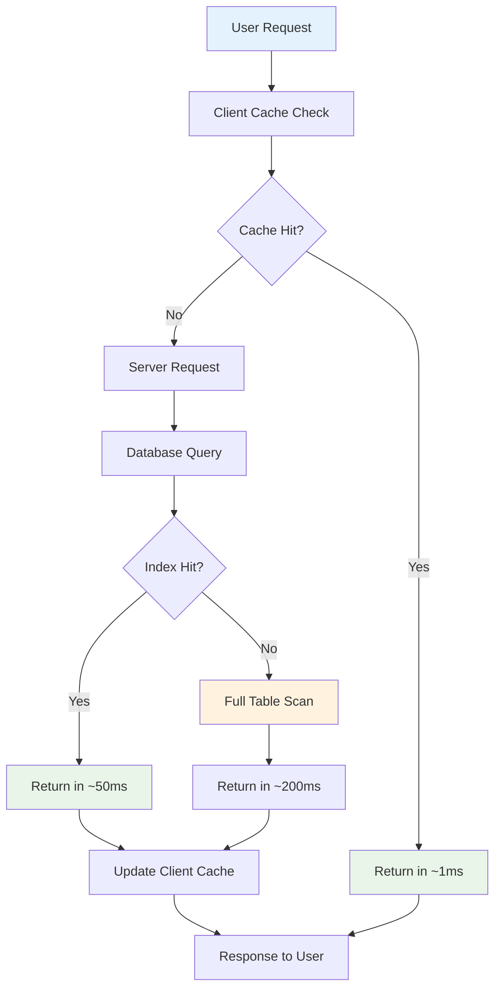

## 📈 Data Update Cycle

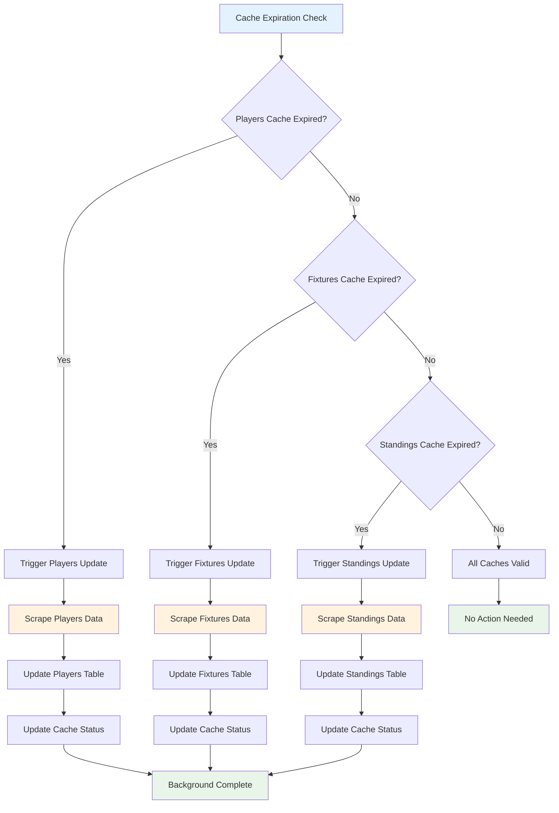

## 🔍 Monitoring & Health Check Flow

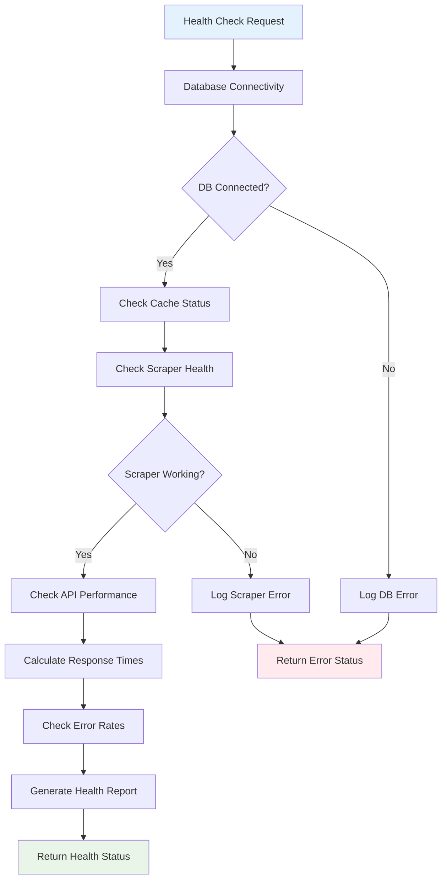

## 🎯 User Journey Flow

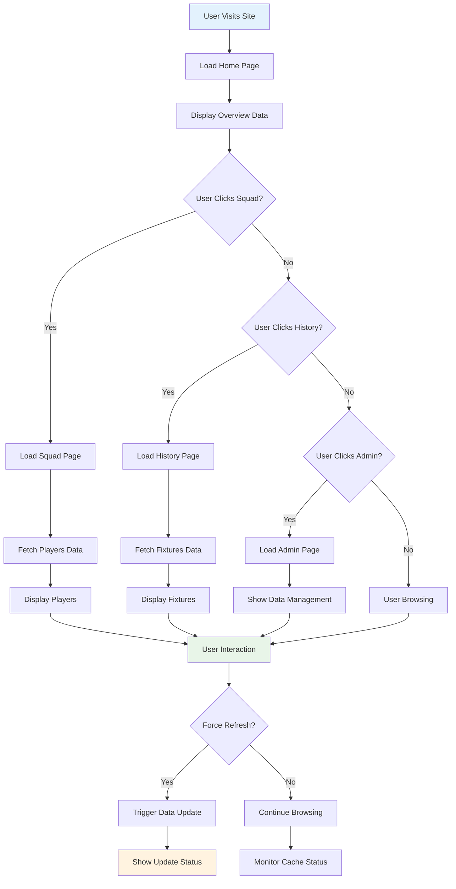

## 🔧 Configuration Management Flow

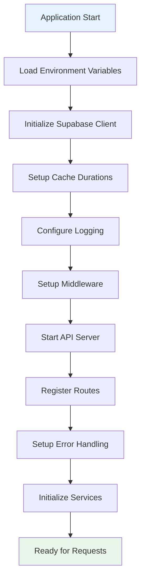

---

_These flowcharts provide a comprehensive visual representation of the system's architecture, data flows, and operational processes._
